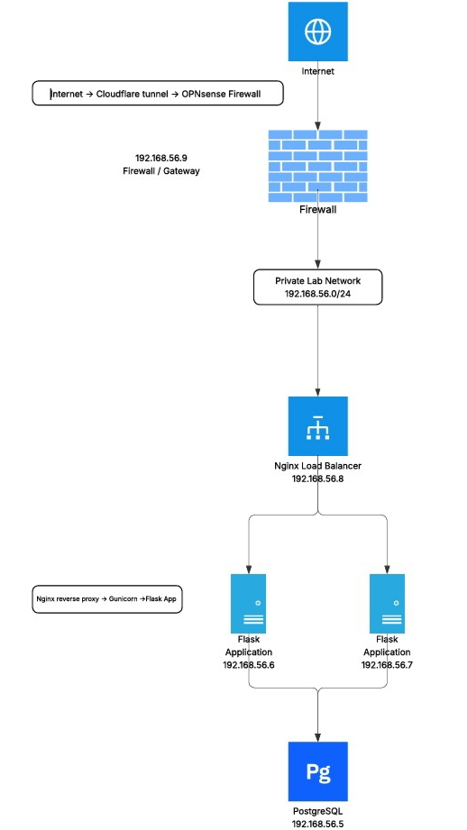

# Production-Style DevOps Home Lab — Phase 1

> A hands-on infrastructure project built to apply networking, Linux administration, server deployment, firewalling, load balancing, backend services, database infrastructure, and secure external access in a self-hosted environment.

## Overview

This project is the first infrastructure phase of my Cloud & DevOps learning roadmap.

Instead of learning infrastructure concepts independently, I built a small production-style environment around a real backend application and progressively turned it into a multi-server architecture.

The goal of this phase was not to follow a deployment tutorial, but to understand how the individual infrastructure components work together as one system.

The environment currently consists of a dedicated firewall/gateway, load balancer, multiple application servers, a separate PostgreSQL database server, and Cloudflare Tunnel for external access.

---

## Architecture



---

### Network Design

The internal infrastructure uses a dedicated private network:

```text
192.168.56.0/24
```

| Component        |     IP Address | Role                                |
| ---------------- | -------------: | ----------------------------------- |
| OPNsense         | `192.168.56.9` | Firewall / Gateway / DNS            |
| Load Balancer    | `192.168.56.8` | Nginx reverse proxy / load balancer |
| Application VM 1 | `192.168.56.6` | Flask + Gunicorn + Nginx            |
| Application VM 2 | `192.168.56.7` | Flask + Gunicorn + Nginx            |
| PostgreSQL       | `192.168.56.5` | Database server                     |

All internal servers use OPNsense as their default gateway.

Direct NAT access from the internal VMs was removed so that outbound traffic from the lab follows the intended gateway architecture.

---

## Application Layer

The infrastructure hosts the backend of my **White** application.

The backend was migrated from a Backend-as-a-Service architecture toward a manually managed infrastructure stack in order to understand what happens underneath managed platforms.

### Backend

* Python
* Flask
* Gunicorn
* Nginx

### Database

* PostgreSQL

The database is hosted on a dedicated VM rather than running on the application servers.

This separation allows the application and database layers to scale and be managed independently.

---

## Infrastructure Components

### OPNsense

Used as the central:

* Firewall
* Network gateway
* DNS resolver
* Internet egress point

All internal servers route external traffic through OPNsense.

### Nginx Load Balancer

The load balancer distributes incoming application requests between the two Flask application servers.

```text
Client
  ↓
Nginx Load Balancer
  ├── VM1
  └── VM2
```

Backend distribution was verified using response headers from the application servers.

### Flask + Gunicorn

Flask provides the application API while Gunicorn acts as the production WSGI application server.

Nginx sits in front of Gunicorn on each application VM.

```text
Nginx
  ↓
Gunicorn
  ↓
Flask
```

### PostgreSQL

PostgreSQL runs on its own dedicated server.

The application servers communicate with PostgreSQL over the private network rather than through the public internet.

### Cloudflare Tunnel

Cloudflare Tunnel provides external access to the application without exposing the internal servers directly to the internet.

The public API is available through:

```text
https://api.white.ps
```

The external traffic path is:

```text
Client
  ↓
Cloudflare
  ↓
Cloudflare Tunnel
  ↓
OPNsense
  ↓
Nginx Load Balancer
  ↓
Application Servers
```

---

## Technology Stack

| Layer                  | Technology                |
| ---------------------- | ------------------------- |
| Firewall / Gateway     | OPNsense                  |
| Load Balancer          | Nginx                     |
| Reverse Proxy          | Nginx                     |
| Backend                | Flask                     |
| Application Server     | Gunicorn                  |
| Database               | PostgreSQL                |
| Secure External Access | Cloudflare Tunnel         |
| Operating System       | Ubuntu Server             |
| Virtualization         | VirtualBox                |
| Network                | Host-Only Private Network |
| API Testing            | Postman / cURL            |

---

## What I Learned

This phase focused on understanding infrastructure as a complete system rather than isolated tools.

### Networking

* Designing a private server network
* IP addressing and routing
* Default gateways
* Understanding traffic flow between network segments
* Separating internal and external traffic
* Understanding how a firewall becomes the network gateway

### Linux Server Administration

* Managing Ubuntu Server VMs
* Network configuration with Netplan
* systemd services
* Service management
* Process and application troubleshooting
* Server-to-server connectivity

### Firewalling

* Deploying OPNsense
* Configuring WAN and LAN interfaces
* Understanding firewall and gateway responsibilities
* Controlling the path between the private network and the internet

### Load Balancing

* Configuring Nginx upstreams
* Running multiple application servers
* Distributing requests between backend instances
* Verifying which backend served a request

### Application Deployment

* Running Flask behind Gunicorn
* Using Nginx as a reverse proxy
* Separating the application server from the database server
* Managing backend services with systemd

### Database Infrastructure

* Running PostgreSQL on a dedicated server
* Connecting application servers to PostgreSQL over the private network
* Managing database access and authentication

### DNS

* Understanding the difference between DNS and routing
* Using OPNsense as the DNS resolver for the internal lab
* Understanding how domain names are translated into IP addresses

### Cloudflare Tunnel

* Understanding tunnel-based external access
* Connecting Cloudflare Tunnel to internal services
* Publishing an internal service without directly exposing the application servers
* Understanding the difference between locally managed and remotely managed tunnels

---

## Validation

The final environment was tested end-to-end.

A request to:

```text
https://api.white.ps/items
```

successfully reached the backend and returned application data from PostgreSQL.

Example response:

```text
HTTP/1.1 200 OK
Server: cloudflare
x-backend-server: VM1
```

The backend response confirmed that the complete path from the public endpoint to the application and database was operational.

The load balancer was also tested independently to verify distribution between VM1 and VM2.

---

## Key Architectural Decisions

### Separate Database Server

The database was intentionally separated from the application servers to model a more realistic multi-tier architecture.

### Two Application Servers

Two Flask instances were used to introduce redundancy and make load balancing meaningful.

### Centralized Gateway

OPNsense became the central gateway for the private infrastructure instead of allowing individual VMs to bypass the firewall through direct NAT.

### Tunnel-Based External Access

Cloudflare Tunnel was used to provide external access without exposing the internal application servers directly.

---

## Phase 1 Outcome

At the end of Phase 1, the lab provides a functional multi-tier infrastructure environment:

```text
Internet
   ↓
Cloudflare
   ↓
Cloudflare Tunnel
   ↓
OPNsense
   ↓
Nginx Load Balancer
   ↓
Flask / Gunicorn
   ↓
PostgreSQL
```

This phase established the infrastructure foundation for the next stages of the roadmap.

---

## Next Phase

### Phase 2 — Observability & Automation

The next phase will extend the existing infrastructure rather than rebuild it.

Planned components include:

* Prometheus
* Node Exporter
* Grafana
* Monitoring dashboards
* Alerting
* Docker
* GitHub Actions

The objective is to move from simply **running infrastructure** to being able to **observe, monitor, and automate it**.
